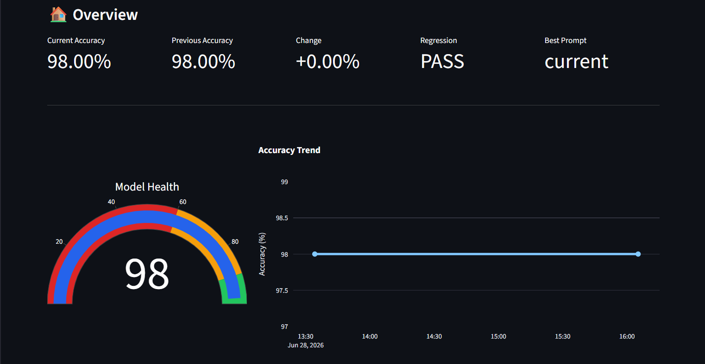
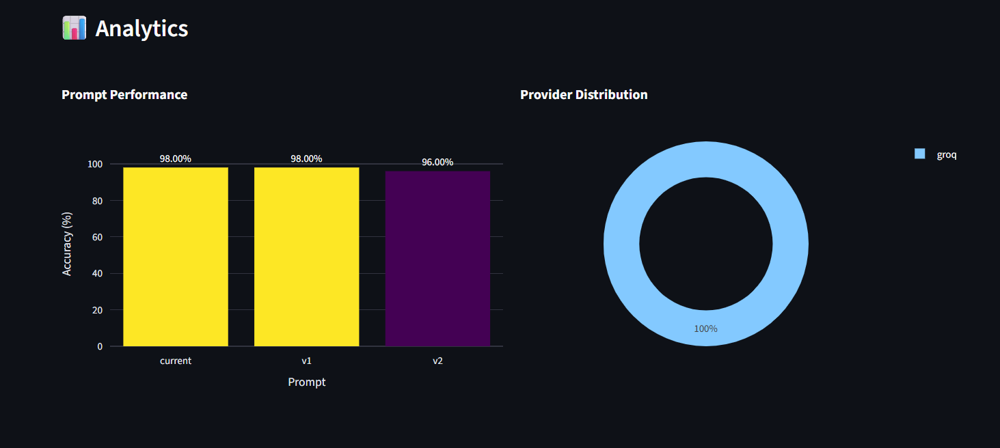
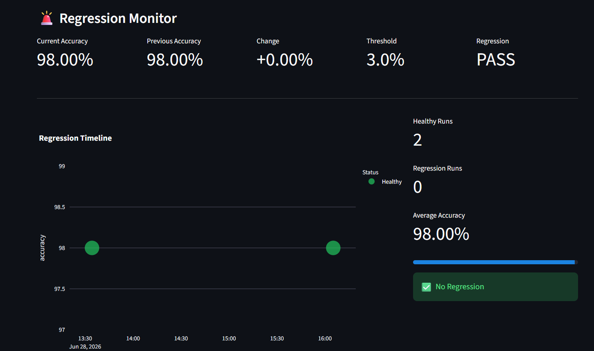
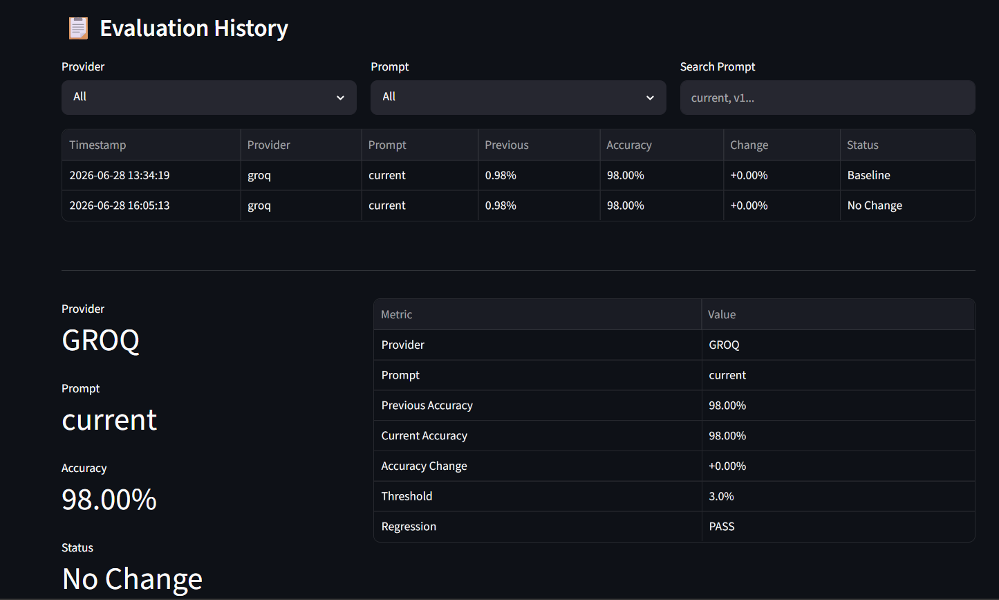
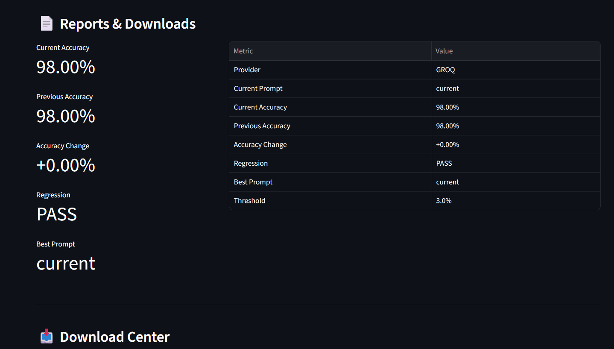
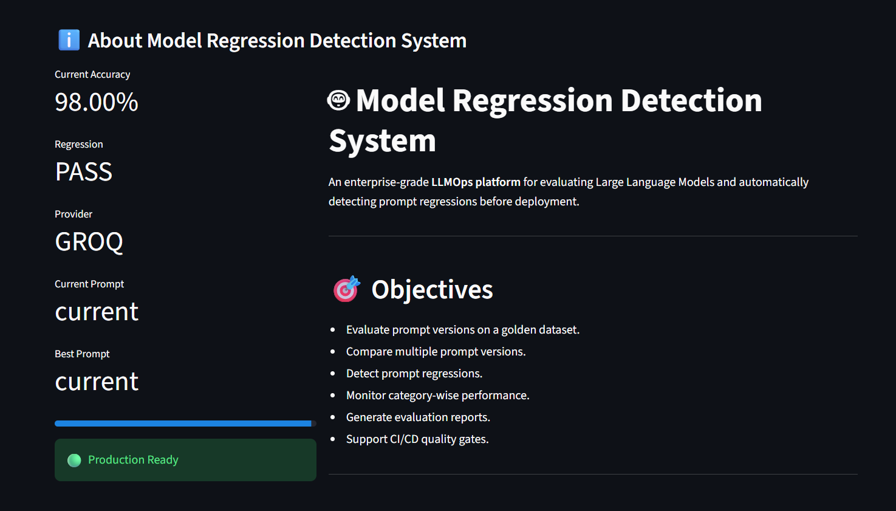

# 🤖 Model Regression Detection System

An enterprise-grade **LLMOps platform** for evaluating Large Language Models (LLMs), comparing prompt versions, detecting prompt regressions, and monitoring model performance through an interactive dashboard.

This project automates the complete evaluation pipeline—from dataset testing to regression analysis and report generation—helping ensure consistent model quality before deployment.

---

# 🚀 Features

- ✅ Multi-LLM Support (Groq & Gemini)
- ✅ Factory Design Pattern
- ✅ Prompt Versioning
- ✅ Golden Dataset Evaluation
- ✅ Prompt Regression Detection
- ✅ Category-wise Performance Analysis
- ✅ Failed Prediction Analysis
- ✅ Evaluation History Tracking
- ✅ Interactive Streamlit Dashboard
- ✅ HTML Report Generation
- ✅ JSON Report Generation
- ✅ Prompt Comparison
- ✅ Regression Timeline
- ✅ Download Center
- ✅ Enterprise Dashboard
- ✅ CI/CD Ready Architecture

---

# 🏗 Project Architecture

```
                         Golden Dataset
                                │
                                ▼
                     Prompt Loader (v1/v2/current)
                                │
                                ▼
                    LLM Factory Pattern
               ┌────────────────┴────────────────┐
               │                                 │
         Groq Client                     Gemini Client
               │                                 │
               └────────────────┬────────────────┘
                                ▼
                      Ticket Classification
                                │
                                ▼
                      Evaluation Engine
                                │
                                ▼
                   Metrics & Regression Engine
                                │
              ┌─────────────────┴─────────────────┐
              │                                   │
         JSON Reports                      HTML Reports
              │                                   │
              └─────────────────┬─────────────────┘
                                ▼
                     Streamlit Dashboard
```

---

# 📂 Project Structure

```
model-regression-detection-system/
│
├── app/
│   ├── llm/
│   │   ├── factory.py
│   │   ├── groq_client.py
│   │   ├── gemini_client.py
│   │   ├── base_client.py
│   │   └── prompts/
│   │       ├── current.txt
│   │       ├── v1.txt
│   │       └── v2.txt
│   │
│   ├── classifier.py
│   ├── config.py
│   ├── prompt_loader.py
│   └── main.py
│
├── dashboard/
│   └── app.py
│
├── datasets/
│   └── golden_dataset.json
│
├── evaluation/
│   ├── evaluator.py
│   ├── metrics.py
│   ├── regression.py
│   ├── category_metrics.py
│   └── report_generator.py
│
├── reports/
│   ├── html/
│   ├── json/
│   └── csv/
│
├── tests/
│
├── utils/
│
├── run_evaluation.py
├── run_prompt_comparison.py
├── requirements.txt
└── README.md
```

---

# ⚙ Technologies Used

### Programming

- Python

### LLM APIs

- Groq API
- Google Gemini API

### Machine Learning

- Scikit-learn
- Pandas
- NumPy

### Dashboard

- Streamlit
- Plotly

### Reports

- HTML
- JSON
- CSV

### Software Engineering

- Factory Pattern
- Object-Oriented Programming
- Modular Architecture

---

# 📊 Dashboard Modules

## 🏠 Overview

- Current Accuracy
- Previous Accuracy
- Accuracy Change
- Regression Status
- Model Health Gauge
- Accuracy Trend
- Latest Evaluation
- Configuration Summary

---

## 📈 Analytics

- Prompt Performance
- Provider Comparison
- Prompt Leaderboard
- Category-wise Accuracy
- Prompt Comparison Table

---

## 🚨 Regression

- Regression Timeline
- Healthy vs Regression Runs
- Regression Summary
- Failed Prediction Analysis

---

## 📋 History

- Evaluation History
- Provider Filter
- Prompt Filter
- Search
- Timeline
- Latest Evaluation Summary

---

## 📄 Reports

- Download JSON Reports
- Download HTML Reports
- Download Prompt Comparison
- System Overview
- Prompt Leaderboard
- Recent Evaluation Runs

---

## ℹ About

- Project Overview
- Objectives
- Architecture
- Technology Stack
- Enterprise Capabilities

---

# 📈 Regression Detection

Each evaluation compares the latest model performance against the previous baseline.

The system automatically detects

- Stable Performance
- Improved Performance
- Performance Regression

Default regression threshold:

```
3%
```

---

# 📊 Prompt Versioning

The system supports multiple prompt versions.

Example:

```
current.txt

v1.txt

v2.txt
```

Each prompt is evaluated independently and compared using

- Overall Accuracy
- Category Accuracy
- Accuracy Difference
- Regression Status

---

# 📂 Generated Reports

After each evaluation the project automatically generates

### JSON

```
comparison_history.json

evaluation_results.json

prompt_comparison.json
```

### HTML

```
comparison_report.html
```

---

# ▶ Running the Project

## 1. Clone Repository

```bash
git clone https://github.com/<your-username>/model-regression-detection-system.git

cd model-regression-detection-system
```

---

## 2. Install Dependencies

```bash
pip install -r requirements.txt
```

---

## 3. Configure Environment Variables

Create a `.env` file

```env
GROQ_API_KEY=YOUR_GROQ_KEY

GEMINI_API_KEY=YOUR_GEMINI_KEY
```

---

## 4. Run Evaluation

```bash
python run_evaluation.py
```

---

## 5. Compare Prompt Versions

```bash
python run_prompt_comparison.py
```

---

## 6. Launch Dashboard

```bash
streamlit run dashboard/app.py
```

---

# 📊 Example Workflow

```
Golden Dataset
       │
       ▼
Prompt Version
       │
       ▼
Groq / Gemini
       │
       ▼
Prediction
       │
       ▼
Evaluation
       │
       ▼
Regression Detection
       │
       ▼
Generate Reports
       │
       ▼
Dashboard Visualization
```

---

# 🎯 Enterprise Capabilities

- Prompt Regression Detection
- Multi-Provider Evaluation
- Continuous Monitoring
- Prompt Version Comparison
- Automated Report Generation
- Evaluation History
- Category-wise Performance Monitoring
- Interactive Analytics Dashboard
- CI/CD Ready Evaluation Pipeline

---

## 📷 Dashboard Screenshots

<p align="center">
  
</p>

<p align="center">
  
</p>

<p align="center">
  
</p>

<p align="center">
  
</p>

<p align="center">
  
</p>

<p align="center">
  
</p>
---

# 📌 Future Improvements

- Docker Deployment
- GitHub Actions CI/CD
- MLflow Integration
- Prompt Experiment Tracking
- REST API
- User Authentication
- Cloud Deployment
- Email Regression Alerts

---

# 👨‍💻 Author

**Jestin Thomas**

**Master of Data Science**

Bengaluru, India

---

# 📄 License

This project is released under the **MIT License**.

---

## ⭐ If you found this project useful, consider giving it a star on GitHub.